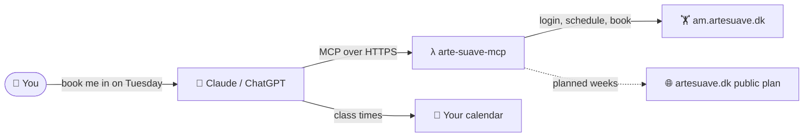
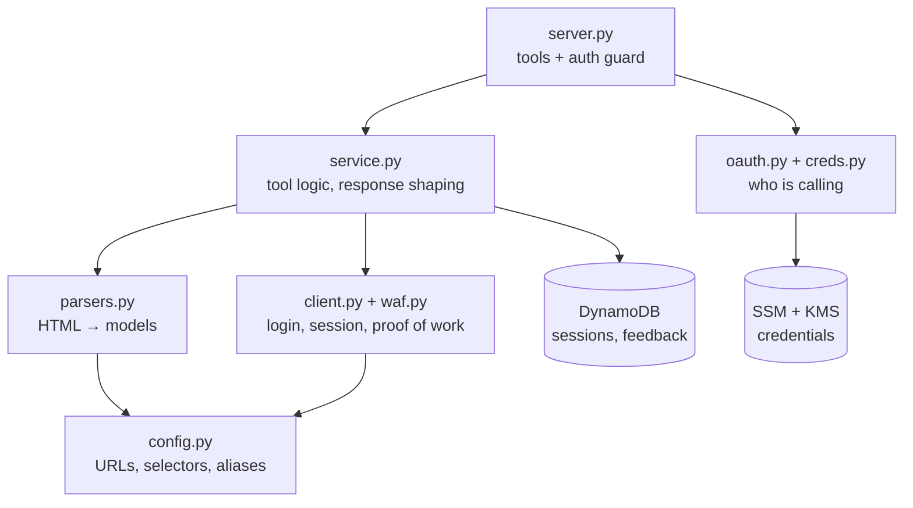

# 🥊 arte-suave-mcp

[](https://github.com/Olafcito/arte-suave-mcp/actions/workflows/deploy.yml)


MCP server for the [Arte Suave](https://artesuave.dk) gym portal in Copenhagen.

I built it so I can manage my muay thai classes from my AI provider and sync
them with my calendar, as part of a personal AI assistant that runs my
training schedule. Ask about the week, book a class, cancel one, check how
much you trained. It runs as a single AWS Lambda. Not affiliated with the gym.



## 🚀 Using it

### Connect

Endpoint: `https://e7rfsehko9.execute-api.eu-north-1.amazonaws.com/mcp`

Add it to your assistant and sign in with your own Arte Suave account on the
login page that opens. Each user gets an isolated session, and credentials
are stored in SSM under a KMS key only the Lambda can decrypt.

| Client | How |
|---|---|
| claude.ai, Claude Desktop | Settings → Connectors → Add custom connector → paste the endpoint |
| ChatGPT (plugins) | Settings → Plugins → Add → paste the endpoint |
| Claude Code | `claude mcp add --transport http --scope user arte-suave <endpoint>` |

For a headless client the owner can mint a static token with
`bash infra/add-user.sh <name>`, sent as `Authorization: Bearer <token>`.

### 💬 Things to ask

> "What muay thai classes are there this week?"

> "Sign me up for the Tuesday and Thursday 17:00 classes and put them in my calendar."

> "What classes am I signed up to?"

> "Cancel Thursday's class."

> "How many times did I train last month, and which disciplines?"

> "Who teaches No Gi on Wednesday?"

Discipline names match loosely. "kickboxing", "muay thai" and "K1" all resolve
to thai boxing, and "MMA Stand up" shows up under thai boxing too. Calendar
entries come from your assistant's own calendar connector. This server only
supplies the class times.

Booking is real. A booking or cancellation is confirmed by reading your
bookings back from the portal. The gym releases next week's classes on
Sunday, and until then the tool shows the planned schedule with a note that
those days cannot be booked yet.

### 🧰 Tools

| Tool | What it does |
|---|---|
| `get_schedule(discipline?, date_from?, date_to?)` | Classes with trainer, time, location and spots. Released days are live and bookable, other days come from the public weekly plan. |
| `get_my_bookings()` | Your current bookings. |
| `get_history(date_from?, date_to?)` | Attendance counts, hours and a per discipline breakdown. |
| `book_class(class_id)` / `cancel_booking(booking_id)` | Book or cancel, confirmed by reading bookings back. |
| `upload_training_pic(image_base64?, note?)` / `get_training_pics()` | Store and list training pictures. An experiment, see `features.md` F2. |
| `submit_feedback(message, context?)` | Leaves a note for the owner. Every note is read and either fixed or written up in `features.md`. |
| `health_check()` | Login plus parser checks. |
| `debug_fetch(target)` | Sanitized raw HTML for when the site changes. |

## 🛠️ Developing

### What you can work on

The parsing, tool logic and tests run fully offline against redacted HTML
fixtures, so anyone can fix a parser, add an alias or reshape a response and
verify it with the test suite. Running the server locally needs an Arte Suave
membership, because it logs in with your own account. Deploying needs your own
AWS account, and the GitHub deploy role is created by hand outside this repo,
so the `infra/` folder is really the owner's deployment. Pull requests for the
Python package are welcome. Infra changes are best raised as an issue first.

### Set up and test

```bash
uv sync
uv run pytest
uv run ruff check .
```

### Run it locally

```bash
LOGIN=... PASSWORD=... uv run arte-suave-mcp   # http://localhost:8080/mcp
ARTESUAVE_LIVE_SMOKE=1 uv run pytest tests/test_live_smoke.py -v   # read only, needs .env
```

`.env` holds real gym credentials and is gitignored.

### 🗺️ How it is put together



- [`DISCOVERY.md`](DISCOVERY.md) explains how the portal works and why the
  code does what it does.
- `features.md` is the backlog. Anything bigger than a one line fix gets a spec
  there first.

### ☁️ Deploy (owner)

```bash
bash infra/put-secrets.sh
bash infra/deploy.sh
```

Needs the AWS CLI and `uv`. Set `AWS_PROFILE` to an admin profile for the
target account, otherwise the default credential chain is used. Region
defaults to `eu-north-1` (`AWS_REGION`). Merging to `main` deploys through
GitHub Actions with OIDC.
